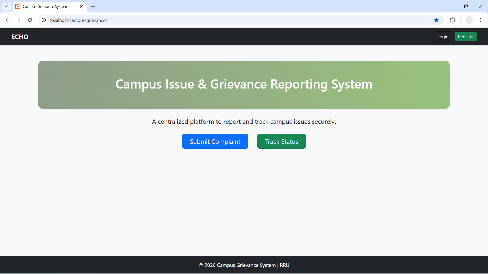
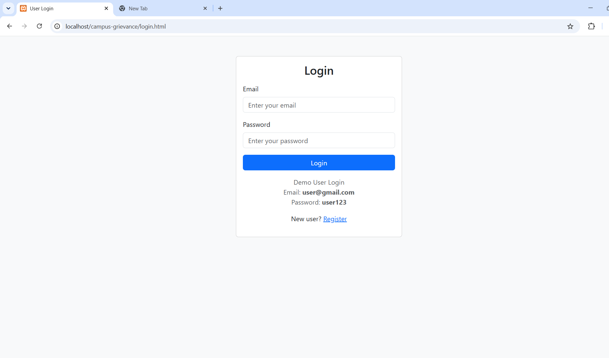
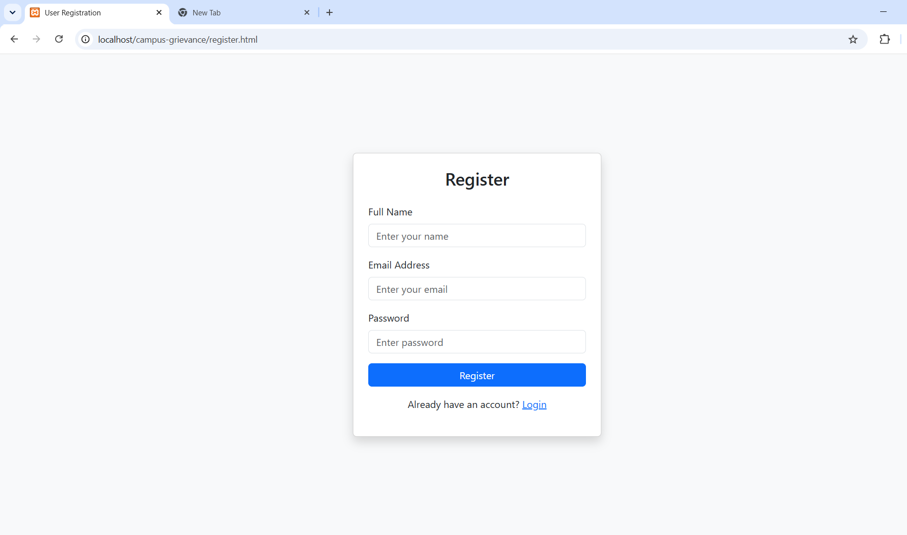
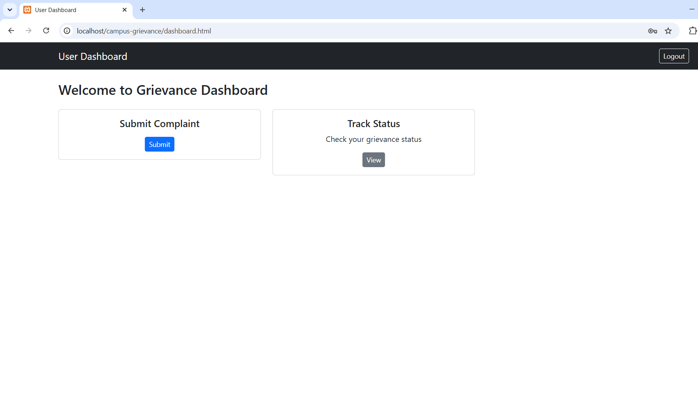
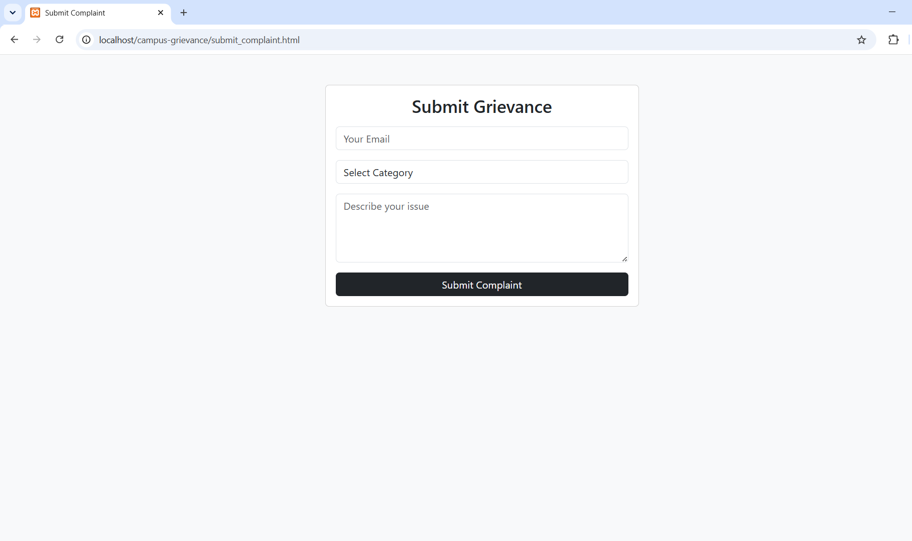
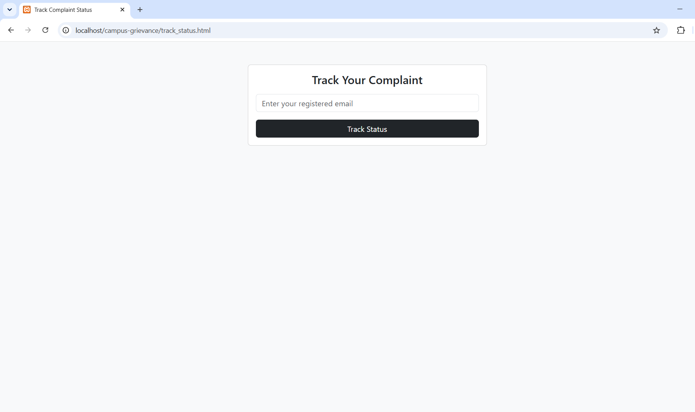
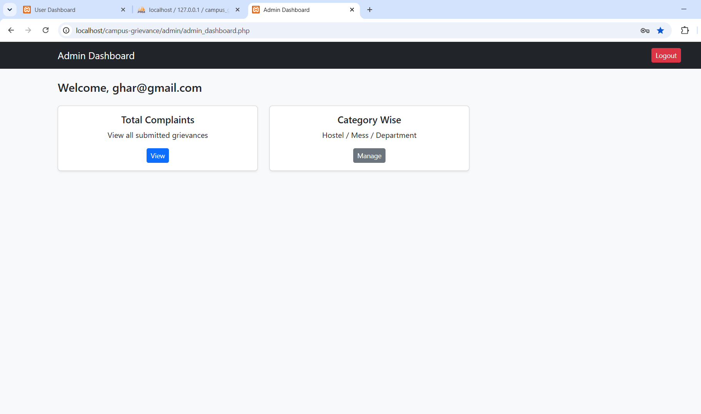

# ECHO - Campus Grievance Reporting System

ECHO is a web-based grievance management platform developed to streamline complaint reporting and resolution within educational institutions.

The system enables students to register, submit grievances, and track complaint progress, while administrators can review, manage, and resolve issues through a dedicated dashboard.

---

## Successor Project

This project represents the original implementation of the Campus Grievance Reporting System.

The enhanced Version 2 (ECHO Campus Grievance Management System) is available here:

[https://github.com/<your-username>/ECHO-campus-grievance-management-system](https://github.com/Jackden404/campus-grievance.git)

## Features

### Student Portal

- User Registration
- Secure Login System
- Submit Campus Grievances
- Categorized Complaints
  - Hostel
  - Mess
  - Department
  - Library
  - Infrastructure
- Track Complaint Status
- Dashboard Interface

### Administrative Portal

- Admin Authentication
- Complaint Management Dashboard
- View All Complaints
- Update Complaint Status
- Session-Based Security
- Automatic Session Timeout

---

## Technology Stack

| Layer | Technology |
|---------|------------|
| Frontend | HTML5, CSS3, Bootstrap 5 |
| Backend | PHP |
| Database | MySQL |
| Server | Apache (XAMPP) |
| Authentication | PHP Sessions |

---

## Project Structure

```text
admin/
├── admin_dashboard.php
├── admin_login.php
├── view_complaints.php
├── update_status.php
└── logout.php

php/
├── connect.php
├── login.php
├── register.php
├── submit_complaint.php
└── track_status.php

index.html
dashboard.html
login.html
register.html
submit_complaint.html
track_status.html
```

---

## Installation

### Clone Repository

```bash
git clone https://github.com/adityavijaymohanpandey-cloud/ECHO-campus-grievance-management-system.git
```

### Move to XAMPP

Copy the project folder to:

```text
C:\xampp\htdocs\
```

### Configure Database

1. Start Apache and MySQL in XAMPP.
2. Open phpMyAdmin by using http://localhost/phpmyadmin/ or clicking on the Admin in XAMPP MySql section.
3. Create database:

```sql
campus_grievance
```

4. Import:

```text
127_0_0_1.sql
```

### Launch

Open your browser and navigate to:

```text
http://localhost/<project-folder-name>
```

Example:

```text
http://localhost/ECHO-campus-grievance-management-system
```

## Screenshots

### Home Page



### Login Page



### Registration Page



### User Dashboard



### Submit Complaint



### Track Status



### Backend


### Server


### Admin Dashboard (make sure to change the role from user to admin in the database to access Admin privilege)



## Security Features

- Password Hashing
- Session-Based Authentication
- Admin Role Verification
- Session Timeout Protection

---

## Future Improvements

- Email Notifications
- Complaint Priority Levels
- File Attachments
- Analytics Dashboard
- Mobile Responsive Enhancements
- Multi-Department Workflow

---

## Contributors

- Abhishek
- Aditya

---

## Academic Project

Developed as a web development and database management academic project.
